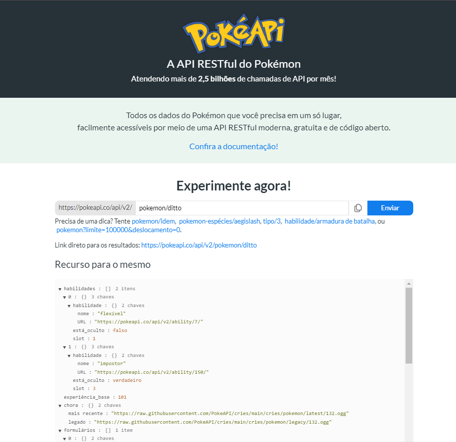
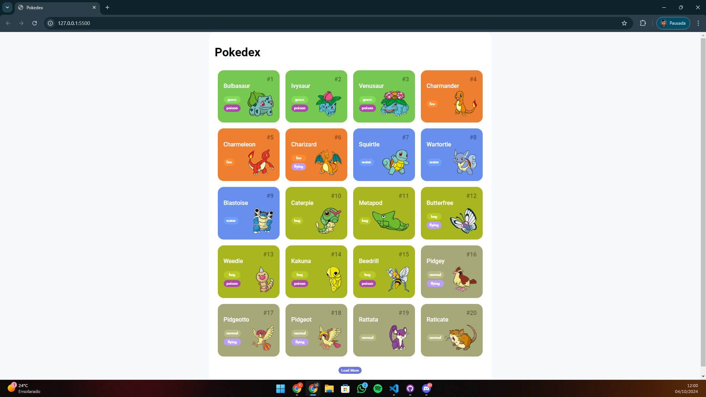

<h1>⚡ Projeto: Pokédex ⚡</h1>

<kbd>✅ FINALIZADO ✅</kbd>

  <table>
        <tr>
            <td>
                
            </td>
            <td>
                <b>Objetivo:</b>
                
O objetivo do projeto será recriar uma pokédex, com todos os pokémons da 1ª Geração.

                
Aplicação dos conhecimentos obtidos durante a formação de JavaScript da DIO

            </td>
        </tr>
    </table>

<h2>Inspiração</h2>

'Pokedex App'
by Saepul Nahwan  
Disponível em: https://dribbble.com/shots/6540871-Pokedex-App#

<h2>Informações dos dados dos Pokémons</h2>

'Todos os dados e imagens dos pokémons foi pego do site: "PokéAPI"' 
Disponível em: https://pokeapi.co/

<h2>PROJETO FINALIZADO</h2>

<h2>Tecnologias utilizadas</h2>
  
  - HTML
  - CSS
  - JavaScript
  - Node.JS
  - Integração via API
  - Git/Github